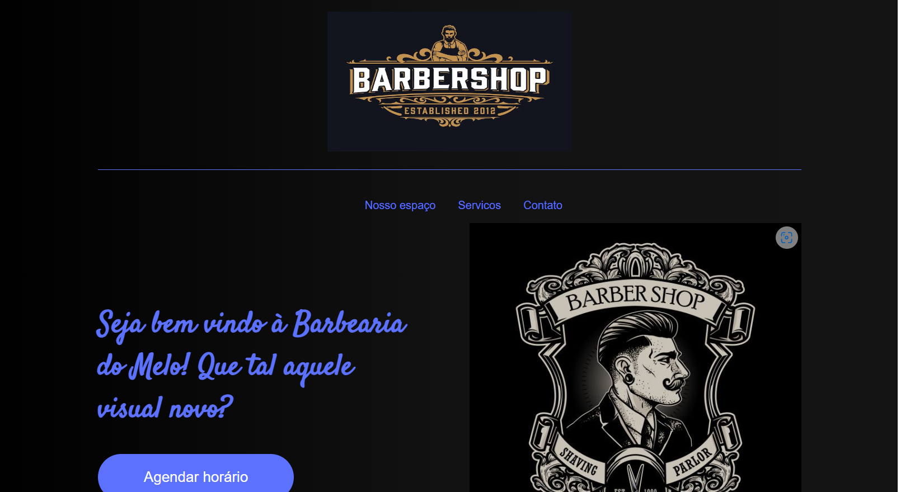

# Barbershop

A barbershop é uma barbearia meramente ilustrativa sem fins lucrativos.

## 🔨 Funcionalidades do projeto

O projeto tem como objetivo principal a utilização do SASS, é um pré-processador de CSS que permite escrever estilos usando uma sintaxe mais fácil e intuitiva, além de adicionar recursos que não estão presentes no CSS puro.

## ✔️ Técnicas e tecnologias utilizadas

-`HTML`
-`CSS`
-`SASS`
-`Acessibilidade Web`

## 🛠️ Abrir e rodar o projeto

Para abrir e rodar o projeto, utilize um editor de código de sua escolha.
Depois, abra o projeto no seu navegador.

## VERCEL 
https://barbershop-beryl.vercel.app/
